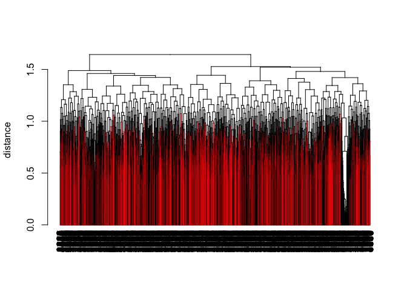

Goal: determine how scattered the wildtypes are using quantitative scores to cluster 
(Wildtypes are defined by the new cutoff=-3.463 illustrated in the file phenptypeCutoff.R) 


```r
## Get the wildtype label (row indices) from All_Data
new.binary = All_Data
new.binary = ifelse(new.binary <= -3.463 | new.binary >= 3.463, 1, 0)

TFvector = apply(new.binary, 1, FUN = function(x) {
    row.sum = sum(x, na.rm = T)
    ifelse(row.sum == 0, T, F)
})

indices = (1:3979)[TFvector]

## Draw the dendrogram from the tree and color the wiltypes
library(dendextend)
library(dplyr)
hclust_pcc_complete %>% as.dendrogram %>% set("by_labels_branches_col", value = indices) %>% 
    plot(ylab = "distance")
```

<!-- -->

```r
## There must be a way to remove the messy x-label but I don't know (Tried
## plot(ann=F), plot(yaxt='n'). They don't work)

rm(TFvector, indices)  ## remove the unnecessary objects
```
Conclusion: wildtypes are scattered throghout the tree instead of clustered together

*This document was knitted by rmarkdown::render("TrivialQuestions/wtInClustering.Rmd") instead of using the newly created environment

