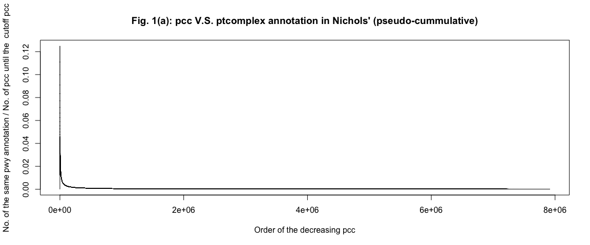
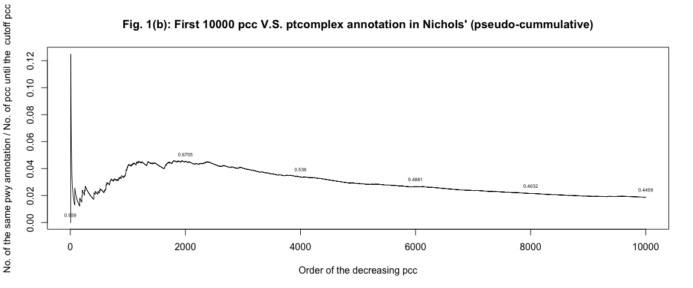
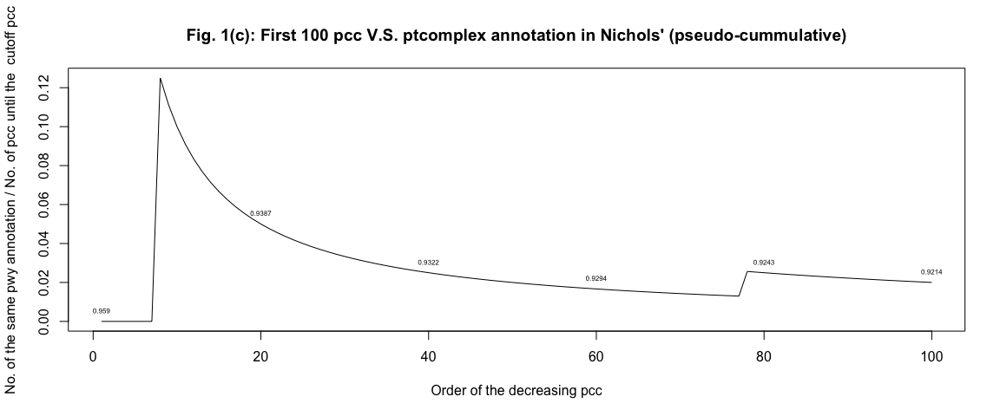
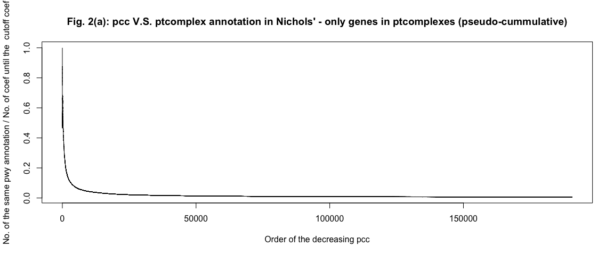
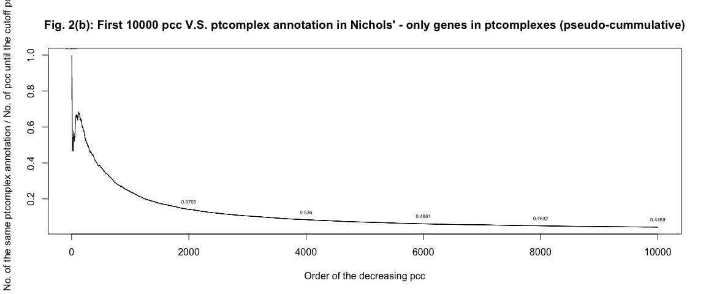
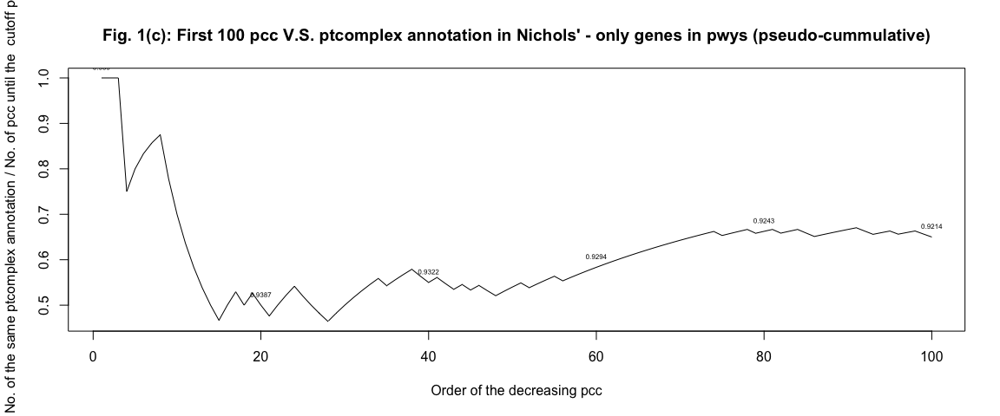

Goal: Determine whether pearson correlation coefficient correlates with pathway annotations to genes


```r
## (!) Solve this: ids with the same genotypes will cause problem in this
## analysis (Eg. duplicated strains)

## Take abs of pcc and sort
abs.strain1strain2.pcc.samePTcomplex_Annot = strain1strain2.pcc.samePTcomplex_Annot
abs.strain1strain2.pcc.samePTcomplex_Annot$Pearson.Correlation.Coefficient = abs(abs.strain1strain2.pcc.samePTcomplex_Annot$Pearson.Correlation.Coefficient)
abs.strain1strain2.pcc.samePTcomplex_Annot = abs.strain1strain2.pcc.samePTcomplex_Annot[order(abs.strain1strain2.pcc.samePTcomplex_Annot$Pearson.Correlation.Coefficient, 
    decreasing = T), ]

## Negative control => Look at the total fraction:
sum(strain1strain2.pcc.samePTcomplex_Annot$bi.ptcomplex.annot)/length(strain1strain2.pcc.samePTcomplex_Annot$bi.ptcomplex.annot)  #0.000154279
```

```
## [1] 0.000154279
```

```r
# Change these 2 variables to run all the following analysis
TF = abs.strain1strain2.pcc.samePTcomplex_Annot$bi.ptcomplex.annot
coef = abs.strain1strain2.pcc.samePTcomplex_Annot$Pearson.Correlation.Coefficient

# Fig. 1 Lineplots of all and the first 10000 (Would take too long to plot
# the whole pcc)
fraction = cumsum(TF)/(1:length(TF))

plot(main = "Fig. 1(a): pcc V.S. ptcomplex annotation in Nichols' (pseudo-cummulative)", 
    1:length(fraction), fraction, type = "l", xlab = "Order of the decreasing pcc", 
    ylab = "No. of the same pwy annotation / No. of pcc until the  cutoff pcc")
```

<!-- -->

```r
plot(main = "Fig. 1(b): First 10000 pcc V.S. ptcomplex annotation in Nichols' (pseudo-cummulative)", 
    1:10000, fraction[1:10000], type = "l", xlab = "Order of the decreasing pcc", 
    ylab = "No. of the same pwy annotation / No. of pcc until the  cutoff pcc")
text(c(1, 2000, 4000, 6000, 8000, 10000), fraction[c(1, 2000, 4000, 6000, 8000, 
    10000)], pos = 3, labels = round(c(coef[1], coef[2000], coef[4000], coef[6000], 
    coef[8000], coef[10000]), 4), cex = 0.5)  #'3' in pos=3 means 'above' 
```

<!-- -->

```r
plot(main = "Fig. 1(c): First 100 pcc V.S. ptcomplex annotation in Nichols' (pseudo-cummulative)", 
    1:100, fraction[1:100], type = "l", xlab = "Order of the decreasing pcc", 
    ylab = "No. of the same pwy annotation / No. of pcc until the  cutoff pcc")
text(c(1, 20, 40, 60, 80, 100), fraction[c(1, 20, 40, 60, 80, 100)], pos = 3, 
    labels = round(c(coef[1], coef[20], coef[40], coef[60], coef[80], coef[100]), 
        4), cex = 0.5)  #'3' in pos=3 means 'above'      
```

<!-- -->

#In this block, only genes that are involved in protein complexes are analyzed

```r
## Take abs of pcc and sort
abs.inptcomplex_strain1strain2.pcc.samePTcomplex_Annot = inptcomplex_strain1strain2.pcc.samePTcomplex_Annot
abs.inptcomplex_strain1strain2.pcc.samePTcomplex_Annot$Pearson.Correlation.Coefficient = abs(abs.inptcomplex_strain1strain2.pcc.samePTcomplex_Annot$Pearson.Correlation.Coefficient)
abs.inptcomplex_strain1strain2.pcc.samePTcomplex_Annot = abs.inptcomplex_strain1strain2.pcc.samePTcomplex_Annot[order(abs.inptcomplex_strain1strain2.pcc.samePTcomplex_Annot$Pearson.Correlation.Coefficient, 
    decreasing = T), ]

ptcomplex.TF = abs.inptcomplex_strain1strain2.pcc.samePTcomplex_Annot$bi.ptcomplex.annot
ptcomplex.coef = abs.inptcomplex_strain1strain2.pcc.samePTcomplex_Annot$Pearson.Correlation.Coefficient


# Fig. 2 Lineplots of all and the first 10000 (Would take too long to plot
# the whole pcc)
fraction = cumsum(ptcomplex.TF)/(1:length(ptcomplex.TF))

plot(main = "Fig. 2(a): pcc V.S. ptcomplex annotation in Nichols' - only genes in ptcomplexes (pseudo-cummulative)", 
    1:length(fraction), fraction, type = "l", xlab = "Order of the decreasing pcc", 
    ylab = "No. of the same pwy annotation / No. of coef until the  cutoff coef")
```

<!-- -->

```r
plot(main = "Fig. 2(b): First 10000 pcc V.S. ptcomplex annotation in Nichols' - only genes in ptcomplexes (pseudo-cummulative)", 
    1:10000, fraction[1:10000], type = "l", xlab = "Order of the decreasing pcc", 
    ylab = "No. of the same ptcomplex annotation / No. of pcc until the cutoff pcc")
text(c(1, 2000, 4000, 6000, 8000, 10000), fraction[c(1, 2000, 4000, 6000, 8000, 
    10000)], pos = 3, labels = round(c(coef[1], coef[2000], coef[4000], coef[6000], 
    coef[8000], coef[10000]), 4), cex = 0.5)  #'3' in pos=3 means 'above' 
```

<!-- -->

```r
plot(main = "Fig. 1(c): First 100 pcc V.S. ptcomplex annotation in Nichols' - only genes in pwys (pseudo-cummulative)", 
    1:100, fraction[1:100], type = "l", xlab = "Order of the decreasing pcc", 
    ylab = "No. of the same ptcomplex annotation / No. of pcc until the  cutoff pcc")
text(c(1, 20, 40, 60, 80, 100), fraction[c(1, 20, 40, 60, 80, 100)], pos = 3, 
    labels = round(c(coef[1], coef[20], coef[40], coef[60], coef[80], coef[100]), 
        4), cex = 0.5)  #'3' in pos=3 means 'above'
```

<!-- -->

```r
# Negative control: I guess sampling many many tims would just be equivalent
# of taking the average (As discribed above):
sum(ptcomplex.TF)/length(ptcomplex.TF)  #0.006404305
```

```
## [1] 0.006404305
```


##If this analysis is ugly, I don't even have to think about fixing the strains (ids with the same genotypes will cause problem in this analysis (Eg. duplicated 


*Knitted by: rmarkdown::render("correlationVSannotation_ptComplex/ptcomplex.correlationVSannotation.Rmd")

