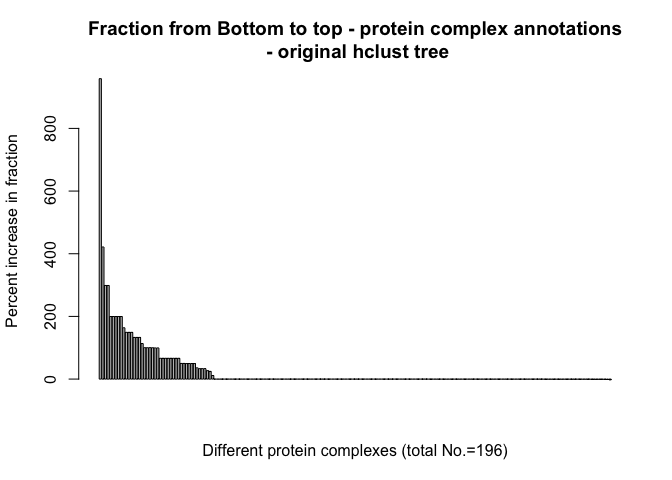
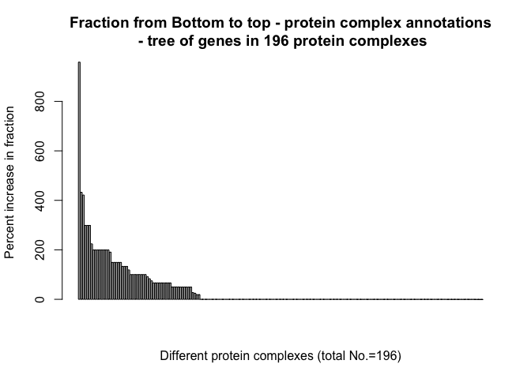
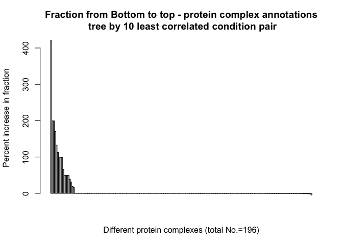

Goal: 


```r
# 1. Use the original hclust tree Barplot of
# (fraction-randomFraction)/randomFraction
percentIncrease = (pcomplexBottomUpExp$`Avg Fraction` - pcomplexBottomUpExp$randomFraction)/(pcomplexBottomUpExp$randomFraction) * 
    100
sort.percentIncrease = sort(percentIncrease, decreasing = T)
barplot(main = "Fraction from Bottom to top - protein complex annotations\n - original hclust tree", 
    sort.percentIncrease, ylab = "Percent increase in fraction", xlab = "Different protein complexes (total No.=196)")
```

<!-- -->

```r
## ~22% of 196 protein complexes show increase in the fraction value => They
## are more clustered than random
sum(percentIncrease > 0)/length(percentIncrease)  # 0.2244898
```

```
## [1] 0.2244898
```

```r
# 2. Use tree generated by only genes in the 196 protein complexes Barplot
# of (fraction-randomFraction)/randomFraction
percentIncrease = (pcomplexOnly.pcomplexBottomUpExp$`Avg Fraction` - pcomplexOnly.pcomplexBottomUpExp$randomFraction)/(pcomplexOnly.pcomplexBottomUpExp$randomFraction) * 
    100
sort.percentIncrease = sort(percentIncrease, decreasing = T)
barplot(main = "Fraction from Bottom to top - protein complex annotations\n - tree of genes in 196 protein complexes", 
    sort.percentIncrease, ylab = "Percent increase in fraction", xlab = "Different protein complexes (total No.=196)")
```

<!-- -->

```r
## ~30% of 196 pprotein complexes show increase in the fraction value => They
## are more clustered than random
sum(percentIncrease > 0)/length(percentIncrease)  # 0.3010204
```

```
## [1] 0.3010204
```

```r
# 3. Use the tree generated by the conditions that are least correlated
# (Abs() of pcc was taken. 10 pairs of pcc were used) Barplot of
# (fraction-randomFraction)/randomFraction
percentIncrease = (least10pcc.pcomplexBottomUpExp$`Avg Fraction` - least10pcc.pcomplexBottomUpExp$randomFraction)/(least10pcc.pcomplexBottomUpExp$randomFraction) * 
    100
sort.percentIncrease = sort(percentIncrease, decreasing = T)
barplot(main = "Fraction from Bottom to top - protein complex annotations\n tree by 10 least correlated condition pair", 
    sort.percentIncrease, ylab = "Percent increase in fraction", xlab = "Different protein complexes (total No.=196)")
```

<!-- -->

```r
## ~9% of 196 protein complexes show increase in the fraction value => They
## are more clustered than random
sum(percentIncrease > 0)/length(percentIncrease)  # 0.09183673
```

```
## [1] 0.09183673
```

```r
# Conclusion:
```

*This document was knitted by rmarkdown::render(“yourfile.rmd”) instead of using the newly created environment
