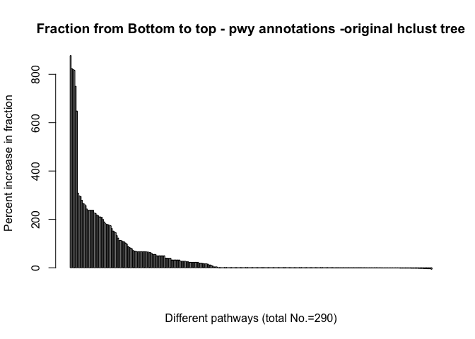
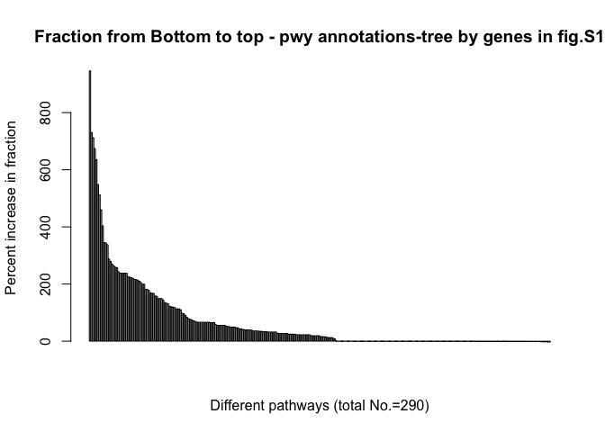

Goal: 


```r
# 1. Use the original hclust tree Barplot of
# (fraction-randomFraction)/randomFraction
percentIncrease = (auto.pwyBottomUpExp$`Avg Fraction` - auto.pwyBottomUpExp$randomFraction)/(auto.pwyBottomUpExp$randomFraction) * 
    100
sort.percentIncrease = sort(percentIncrease, decreasing = T)
barplot(main = "Fraction from Bottom to top - pwy annotations -original hclust tree", 
    sort.percentIncrease, ylab = "Percent increase in fraction", xlab = "Different pathways (total No.=290)")
```

<!-- -->

```r
## ~41% of 290 pathways show increase in the fraction value => They are more
## clustered than random
sum(percentIncrease > 0)/length(percentIncrease)  # 0.4068966
```

```
## [1] 0.4068966
```

```r
# 2. Use tree generated by gene ids in fig S1 Barplot of
# (fraction-randomFraction)/fraction
percentIncrease = (figS1genes.pwyBottomUpExp$`Avg Fraction` - figS1genes.pwyBottomUpExp$randomFraction)/(figS1genes.pwyBottomUpExp$randomFraction) * 
    100
sort.percentIncrease = sort(percentIncrease, decreasing = T)

barplot(main = "Fraction from Bottom to top - pwy annotations-tree by genes in fig.S1", 
    sort.percentIncrease, ylab = "Percent increase in fraction", xlab = "Different pathways (total No.=290)")
```

<!-- -->

```r
## ~53% of 290 pathways show increase in the fraction value => They are more
## clustered than random
sum(percentIncrease > 0)/length(percentIncrease)  # 0.5344828
```

```
## [1] 0.5344828
```

```r
# 3. Use the tree generated by the conditions that are least correlated
# (Abs() of pcc was taken. 10 pairs of pcc were used)
percentIncrease = (least10pcc.pwyBottomUpExp$`Avg Fraction` - least10pcc.pwyBottomUpExp$randomFraction)/(least10pcc.pwyBottomUpExp$randomFraction) * 
    100
sort.percentIncrease = sort(percentIncrease, decreasing = T)

barplot(main = "Fraction from Bottom to top - pwy annotations-tree by 10 least \ncorrelated condition pair", 
    sort.percentIncrease, ylab = "Percent increase in fraction", xlab = "Different pathways (total No.=290)")
```

<!-- -->

```r
## ~22% of 290 pathways show increase in the fraction value => They are more
## clustered than random
sum(percentIncrease > 0)/length(percentIncrease)  # 0.2206897
```

```
## [1] 0.2206897
```

```r
# Conclusion: The result from original hclust tree doesn't seem to be very
# good from our quick glimpse. But more detailed discussion is needed to
# verify. The result from figS1's geneID hclust tree doesn't seem to be very
# good from our quick glimpse. But more detailed discussion is needed to
# verify.
```

*This document was knitted by rmarkdown::render(“yourfile.rmd”) instead of using the newly created environment
